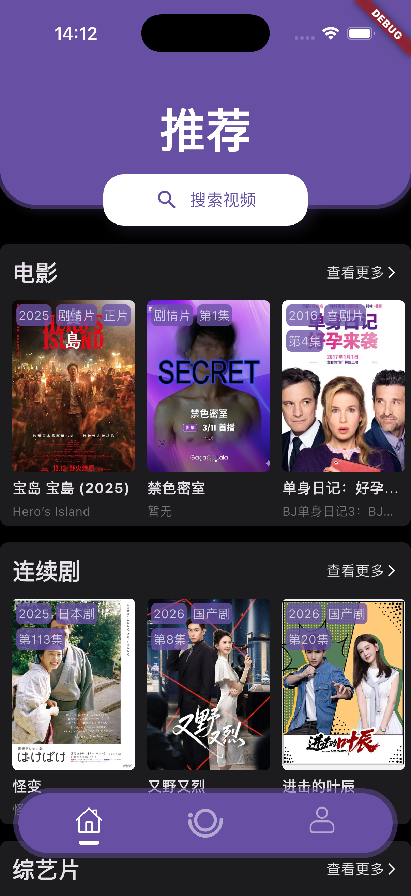
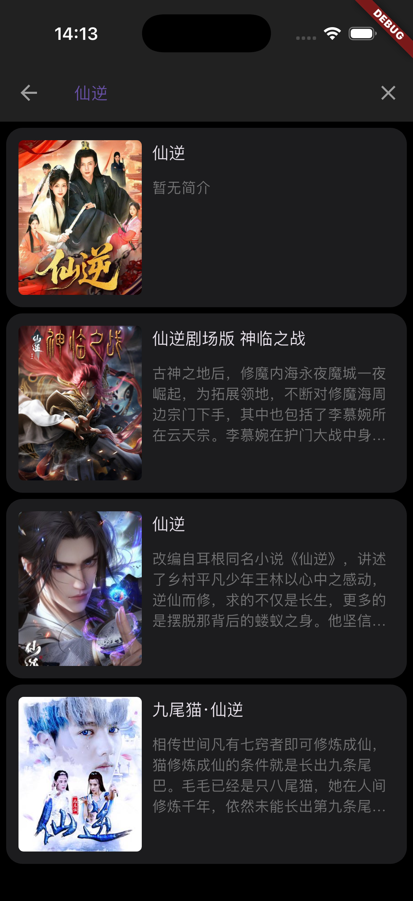
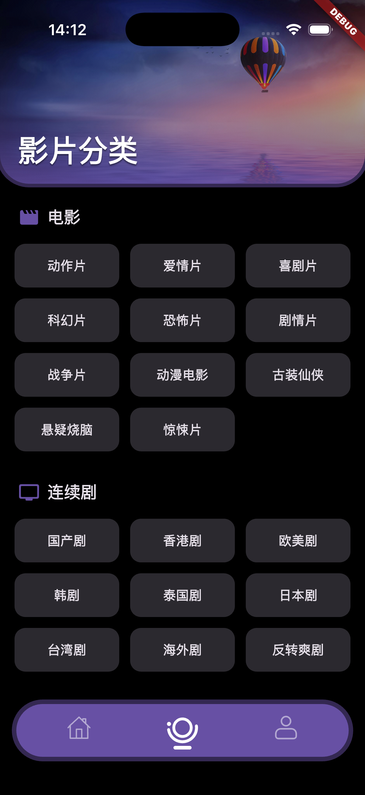
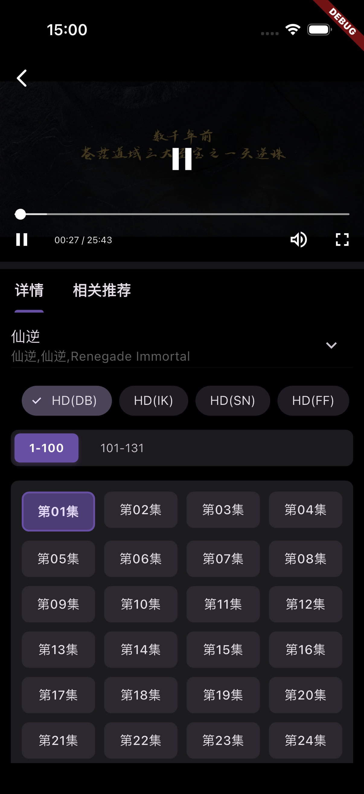

# 🎬 Bracket

**一款基于 Flutter 构建的极致免费观影体验 App**

> A professional video streaming application built with Flutter, focused on simplicity and performance.

[](https://dart.dev)
[](https://flutter.dev)
[](https://fvm.app)
[](LICENSE)
[](https://github.com/fe-spark/Bracket-App/actions)

---

## ✨ 项目特色 | Features

- 🚀 **极致流畅**：基于 Flutter 渲染引擎，提供原生级别的交互体验。
- 📱 **跨端支持**：完美支持 Android 与 iOS (越狱/自签)。
- 🎨 **简约设计**：现代化的 UI 设计，支持海报墙展示。
- 📄 **数据灵活**：通过 [Bracket-Film](https://github.com/fe-spark/Bracket-Film) 接入，支持自定义视频源。
- 🤖 **自动化构建**：全流程 GitHub Actions 自动化打包释放。

---

## 🏗️ 快速开始 | Getting Started

### 环境要求
- Flutter SDK `3.38.5` (建议使用 [FVM](https://fvm.app) 管理)
- Dart SDK `3.10.4`

### 运行步骤
```bash
# 获取依赖
f pub get

# 生成代码 (JsonSerializable)
f pub run build_runner build --delete-conflicting-outputs

# 运行项目
f run
```

---

## 🛠️ 构建与编译 | Build

### Android
```bash
f build apk --release
```

### iOS (Unsigned)
```bash
f build ios --release --no-codesign
```

### 🤖 CI/CD 自动化打包
项目已深度配置 GitHub Actions，您无需本地配置环境即可获取产物：
- **触发方式**：向仓库推送 `v*` 格式的标签（例如 `v1.5.0`）。
- **同步发布**：产物（APK & Unsigned IPA）将自动上传至 GitHub **Releases** 页面。
- **手动触发**：在 GitHub Actions 面板手动点击 `Run workflow`。

---

## 📸 界面预览 | Preview

| 影视源配置 | 首页推荐 | 搜索页面 |
| :---: | :---: | :---: |
|  |  |  |

| 分类浏览 | 筛选体验 | 播放详情 | 个人中心 |
| :---: | :---: | :---: | :---: |
|  |  |  |  |

---

## 📡 视频源说明 | Data Source
本项目不存储任何视频数据，仅作为视频播放器。
- **默认服务**：[网页版地址](http://74.48.78.105:3000/)
- **API 接口**：`https://film.fe-spark.cn/api/` (由于带宽限制，高峰期可能访问缓慢)。
- **自定义搭建**：如需稳定体验，建议参考 [Bracket-Film](https://github.com/fe-spark/Bracket-Film) 自行搭建后端。

---

## ⚖️ 免责声明 | Disclaimer
1. 本项目仅供 **学习交流** 使用，严禁用于任何商业用途。
2. 数据来源均源于网络公开接口，开发者不承担任何资源版权责任。
3. 若您认为本项目侵犯了您的合法权益，请通过邮箱及时联系，我们将尽快处理。

---

> Created with ❤️ by fe-spark
